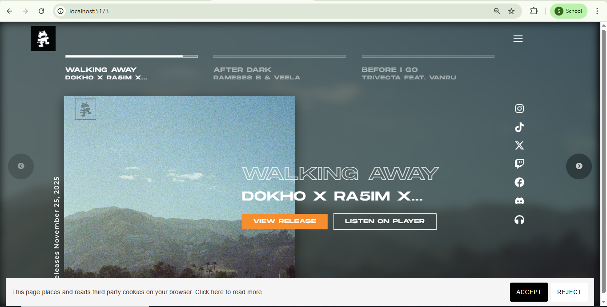
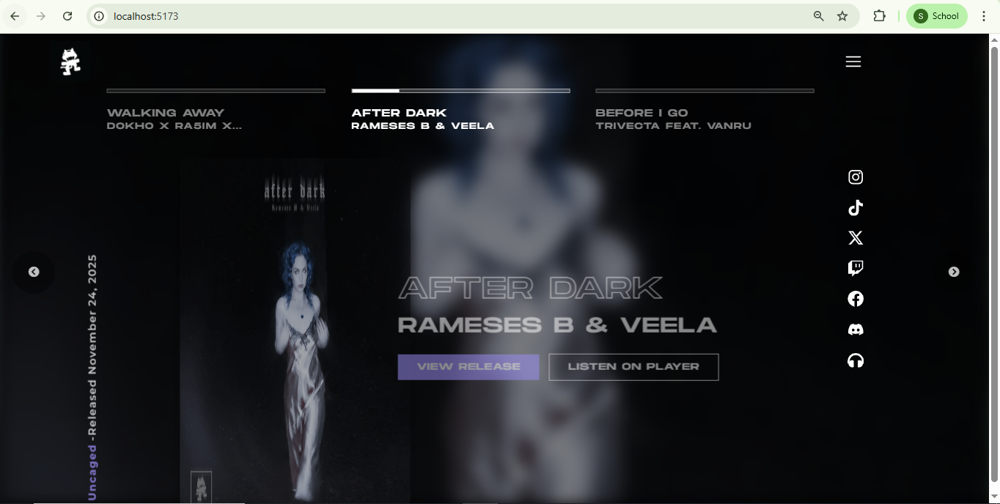
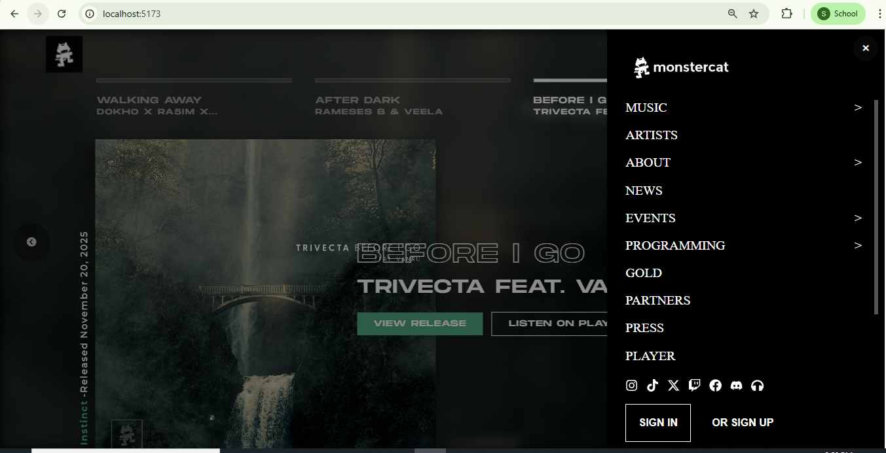

# Monstercat Album Carousel

 This project reproduces key UI and UX elements of the Monstercat website through clean, component-driven React architecture. The carousel is implemented using **React Slick** and features full-screen background transitions, per-slide metadata, progress bar animations, and customizable navigation arrows. A responsive sliding side menu and a dismissible cookie consent banner complete the UI. Typography for the project was sourced using browser DevTools to match Monstercat's styling more accurately.

## Project Screenshots
 
  

---

## Features

### **1. Fullscreen React Slick Carousel**
- Utilizes **react-slick** for smooth transitions, autoplay, and custom arrow rendering.  
- 100vh album sections with dynamic background images.  
- Synced progress bar animation tied to autoplay timing.  
- Custom metadata block: title, artist, category color, release date.  

### **2. Sliding Side Menu **
- Right-side overlay navigation implemented as a separate **SideMenu** component.  
- Expandable dropdown sections driven by local state.   
- Integrated social icon bar using React Icons.  
- Flexible layout suitable for insertion into any navbar component.

### **3. Cookie Consent Banner**
- Persistent bottom banner built as an independent component.  
- Simple state-based dismissal.  

### **4. Typography & Style Matching**
- Font families and layout metrics were identified via browser **DevTools** and re-implemented in custom CSS. 
